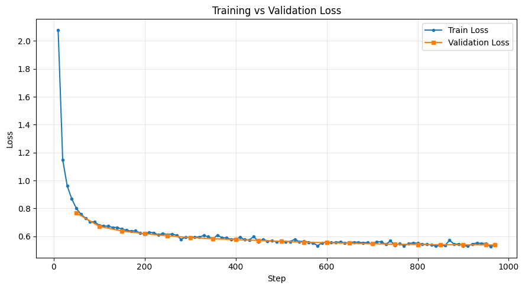

# Qwen2.5-3B-Instruct Fine-Tuned for Customer Support

Fine-tuned [Qwen/Qwen2.5-3B-Instruct](https://huggingface.co/Qwen/Qwen2.5-3B-Instruct) on the 
[Bitext Customer Support LLM Chatbot dataset](https://huggingface.co/datasets/bitext/Bitext-customer-support-llm-chatbot-training-dataset) 
using Unsloth + TRL's SFTTrainer for efficient LoRA fine-tuning.

## Overview

- **Base model:** Qwen2.5-3B-Instruct (4-bit quantized)
- **Method:** Supervised Fine-Tuning (SFT) with LoRA via Unsloth
- **Dataset:** Bitext customer support chatbot dataset
  - Train: 22,166
  - Validation: 1,231
  - Test: 1,232
- **Framework:** Hugging Face TRL (`SFTTrainer`), Unsloth for memory-efficient training
- **Platform:** Google Colab

## Why Unsloth

Unsloth was used to speed up training and reduce VRAM usage, enabling larger batch sizes 
and 8-bit optimizer support (`adamw_8bit`) without sacrificing training stability.

## Model & LoRA Configuration

\`\`\`python
model, tokenizer = FastLanguageModel.from_pretrained(
    model_name,
    max_seq_length=256,
    dtype=None,
    load_in_4bit=True,
)

model = FastLanguageModel.get_peft_model(
    model,
    r=16,
    lora_alpha=32,
    lora_dropout=0.05,
    target_modules=["q_proj", "k_proj", "v_proj", "o_proj", 
                     "gate_proj", "up_proj", "down_proj"],
    use_gradient_checkpointing="unsloth",
)
\`\`\`

## Training Configuration

| Parameter | Value |
|---|---|
| Epochs | 1 |
| Per-device batch size | 8 |
| Gradient accumulation | 2 (effective batch = 16) |
| Learning rate | 2e-4 |
| LR scheduler | cosine |
| Warmup steps | 10 |
| Max sequence length | 256 |
| Packing | enabled |
| Optimizer | adamw_8bit |
| Precision | bf16/fp16 (auto-detected) |
| LoRA rank (r) | 16 |
| LoRA alpha | 32 |
| LoRA dropout | 0.05 |
| Target modules | q/k/v/o_proj, gate/up/down_proj |

Full config: [`configs/training_args.json`](configs/training_args.json)

## Setup

\`\`\`bash
pip install -r requirements.txt
\`\`\`

## Results

### Training & Validation Loss

Loss dropped sharply from ~2.08 at step 10 to under 0.8 by step 50, then converged 
smoothly to ~0.55 by step 600 and remained stable through the rest of training. 
Validation loss tracked training loss closely throughout, with no divergence — 
indicating good generalization and no overfitting within the single epoch.

## Note on Checkpoints

The trained LoRA adapter weights were lost due to a Colab session timeout before 
they could be exported/pushed to the Hugging Face Hub. This repository documents 
the full training pipeline, configuration, and results (loss curves, sample outputs 
captured during the session) so the run is fully reproducible. Re-running 
`notebooks/finetune_qwen_unsloth.ipynb` with the same config will reproduce 
equivalent results.

**Best practice going forward:** save adapter checkpoints to 
Google Drive or push to HF Hub (`model.push_to_hub(...)`) periodically during 
training, not just at the end.

## Limitations

- Trained for only 1 epoch — may underfit
- Domain-specific to customer support; not general-purpose
- Adapter checkpoints not preserved (see note above); training is reproducible via notebook

## Acknowledgements

- [Unsloth](https://github.com/unslothai/unsloth)
- [Bitext](https://huggingface.co/bitext) for the dataset
- [Qwen team](https://huggingface.co/Qwen) for the base model
